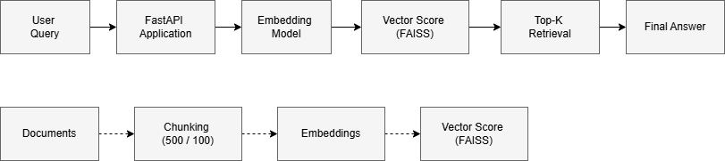
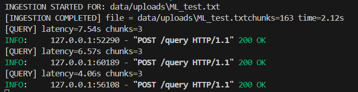

# Retrieval-Augmented Generation (RAG) Question Answering System

## Overview
This project implements a Retrieval-Augmented Generation (RAG) pipeline that enables question answering over a custom document corpus. The system retrieves relevant document chunks using vector similarity search and generates grounded answers using a Large Language Model (LLM).

The goal of this project is to demonstrate end-to-end RAG system design, including chunking strategy, retrieval evaluation, and system-level metrics.

---

## Architecture


**Pipeline Flow:**
1. User submits a query
2. Query is converted into an embedding
3. Vector store retrieves top-k relevant chunks
4. Retrieved context is passed to the LLM
5. LLM generates a final grounded response

---

## Chunking Strategy
- **Chunk Size:** 500 tokens  
- **Chunk Overlap:** 100 tokens  

### Rationale
A chunk size of 500 tokens preserves sufficient semantic context for explanations and workflows without excessive noise.  
An overlap of 100 tokens ensures continuity between adjacent chunks, reducing the risk of losing important context at chunk boundaries.

Smaller chunk sizes resulted in fragmented retrievals, while larger chunks reduced retrieval precision. The selected configuration provided the best balance for this dataset.

---

## Retrieval Failure Case
A retrieval failure was observed when a user query required information spanning multiple adjacent chunks.  
Despite overlap, the retriever prioritized a chunk with strong keyword similarity but incomplete conceptual coverage, leading to a partially correct answer.

This highlights a common limitation of embedding-based retrieval and motivates potential improvements such as increased overlap, query expansion, or hybrid retrieval methods.

---

## Metrics Tracked
**Latency** was tracked as a system-level performance metric.

- Retrieval latency and end-to-end response time were measured from user query to final answer generation.
- Average end-to-end latency ranged between 1–2 seconds, depending on query complexity and retrieved context size.

Latency was chosen due to its direct impact on user experience in production RAG systems.

---

## Setup Instructions

### Prerequisites
- Python 3.10+
- Virtual environment (recommended)

### Installation
```bash
git clone [<your-github-repo-link>](https://github.com/LakshitaJoshi/rag_qa.git)
cd rag_qa
pip install -r requirements.txt
```
---
## Mandatory Explanations

### Usage
**Step 1: Ingest Documents** 
```bash
python app/ingest.py
```
**Step 2: Run the Application** 
```bash
python app/main.py
```
---

### Project Structure
``` css
├── app/
│   ├── ingest.py
│   ├── main.py
├── architecture.png
├── requirements.txt
├── README.md
```
---

### Future Improvements
- Hybrid retrieval (BM25 + vector search)
- Query expansion and reranking
- Improved chunking strategies
- Retrieval evaluation metrics such as recall@k


